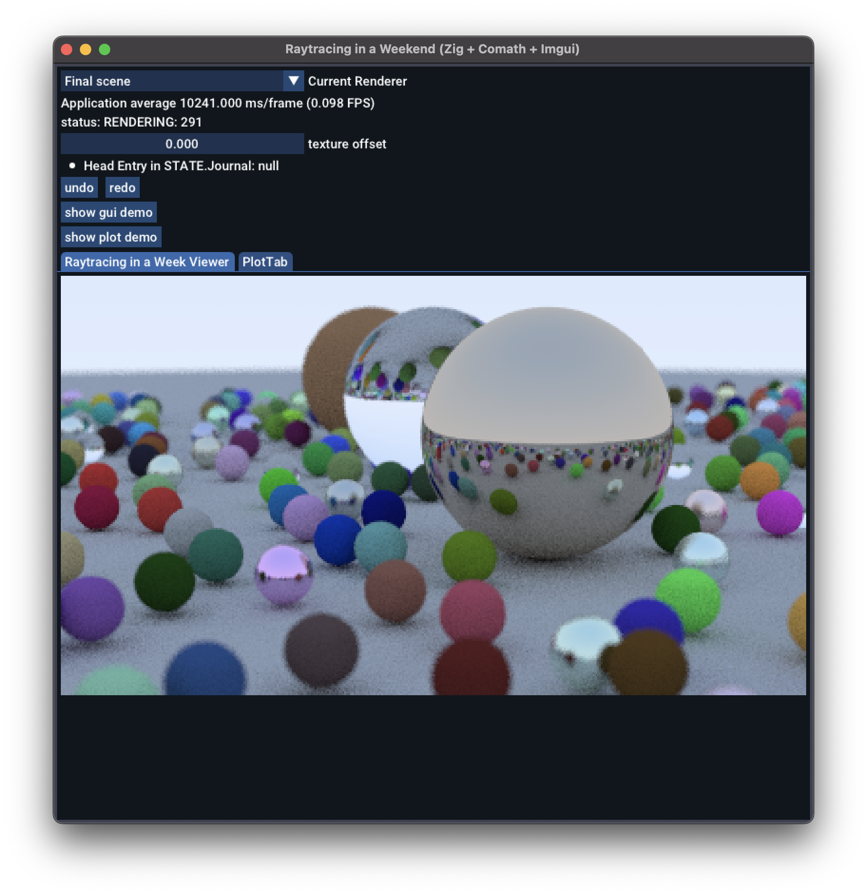

# Zig Raytracing in a Weekend

Experimenting with a Raytracing in a Weekend[^1] implementation in Zig, using
comath[^2] and zgui/sokol/imgui[^3] for a UI.

[^1]: Book: [Raytracing in a Weekend](https://raytracing.github.io/books/RayTracingInOneWeekend.html)
[^2]: Dependency: [https://github.com/InKryption/comath](https://github.com/InKryption/comath)
[^3]: Dependency: [https://github.com/ssteinbach/zgui_cimgui_implot_sokol](https://github.com/ssteinbach/zgui_cimgui_implot_sokol)



## tests

```
zig buld test
```

## running the viewer

```
zig build viewer
```

## Todo

* [x] report % done
* [x] cancel ongoing render when changing renderers
* [ ] UI Pass
* [ ] other books
* [ ] temporal iterative refinement
* [ ] multithread the renderer
* [ ] performance heatmap AOV
* [ ] reorganize UI into a menu
